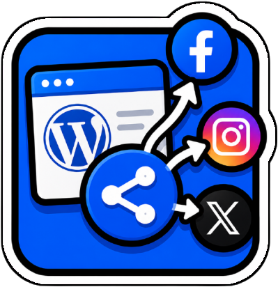

# WP PK SocialSharing



[🇫🇷 FR](README.md) · [🇬🇧 EN](README_en.md)

✨ Plugin WordPress pour publier automatiquement ou manuellement les articles sur LinkedIn, X, Facebook, Instagram, Threads et Medium.

## ✅ Fonctionnalités

- Publication automatique lors du passage d’un article en `publish`.
- Partage manuel depuis l’admin pour tester ou relancer un réseau précis.
- Réseaux pris en charge : LinkedIn, X, Facebook, Instagram, Threads et Medium.
- Tableau de bord avec les articles planifiés/publiés, les statuts de partage et les liens des posts sociaux.
- Colonne “Partages” dans la liste des articles WordPress avec icônes réseau grisées ou actives.
- Image mise en avant utilisée pour Facebook et Instagram quand le réseau le permet.
- Retry WP-Cron toutes les 5 minutes pour les partages en attente.
- Fallback WP-CLI pour relancer les publications sans dépendre de WP-Cron.
- Configuration Meta centralisée : connexion OAuth, token longue durée, détection Page Facebook et compte Instagram.
- Publication X via API ou fallback navigateur si les crédits API sont insuffisants.

## 🧠 Utilisation

1. Installer et activer le plugin WordPress.
2. Aller dans `WP Admin > WP PK SocialSharing`.
3. Configurer les réseaux nécessaires dans leurs onglets.
4. Publier ou programmer un article WordPress.
5. Vérifier le statut dans le dashboard ou dans la colonne “Partages” de la liste des articles.

Le partage automatique se déclenche au moment où l’article passe en statut `publish`. Les articles déjà publiés peuvent être partagés depuis les blocs de test ou relancés via WP-CLI.

## ⚙️ Réglages

- `Dashboard` : vue synthétique des articles planifiés/publiés et de l’état par réseau.
- `Jour` : suivi des publications du jour.
- `LinkedIn` : OAuth LinkedIn, Author URN profil ou organisation, visibilité, format du message.
- `X (Twitter)` : clés API, mode automatique si les crédits API sont disponibles, mode manuel via navigateur sinon.
- `Facebook` : Page ID, Page Access Token, publication sur Page avec image mise en avant si disponible.
- `Instagram` : IG User ID, Access Token, publication via Instagram Graph API.
- `Threads` : Threads User ID, Access Token, publication via API Threads.
- `Medium` : Integration token, User ID, statut `public`, `draft` ou `unlisted`.
- `Meta` : App ID, App Secret et connexion OAuth pour obtenir un token longue durée et remplir Facebook/Instagram proprement.
- `Types de contenu` : choix des post types autorisés pour la publication automatique.

## 🧾 Commandes

Relancer les partages en attente :

```bash
wp pksocialsharing retry --network=x --limit=20
```

Exemples :

```bash
wp pksocialsharing retry --network=facebook --limit=10
wp pksocialsharing retry --network=instagram --limit=10
wp pksocialsharing retry --limit=50
```

Route REST de synchronisation utilisée par le workflow local quand le plugin est déjà installé :

```text
/wp-json/pksocialsharing/v1/sync-plugin
```

## 📦 Build & Package

Il n’y a pas de build JavaScript ou CSS obligatoire.

Le code du plugin est dans :

```text
src/pk-linkedin-autopublish/
```

Le nom du dossier reste `pk-linkedin-autopublish` pour compatibilité avec les installations existantes, mais le plugin affiché dans WordPress s’appelle désormais `WP PK SocialSharing`.

## 🧪 Installation

Installation manuelle :

1. Copier `src/pk-linkedin-autopublish/` dans `wp-content/plugins/pk-linkedin-autopublish/`.
2. Activer `WP PK SocialSharing` depuis `Extensions`.
3. Ouvrir `WP Admin > WP PK SocialSharing`.
4. Configurer les réseaux souhaités.

Mise à jour live :

- Le dépôt contient un workflow de synchronisation REST pour pousser les fichiers du plugin sans générer de zip.
- Après une mise à jour, vérifier la version affichée dans WordPress et tester un partage manuel sur le réseau modifié.

## 🧾 Changelog

- `1.1.1` : renommage documentation/plugin en `WP PK SocialSharing`, README FR/EN, guide Meta clarifié.
- `1.1.0` : connexion Meta OAuth longue durée, détection automatique Facebook/Instagram, dashboard et colonne de statuts.
- `0.91` : conversion d’un token Graph Explorer court en token longue durée.
- `0.90` : barre admin simplifiée avec libellé texte et badge.
- `0.80` : colonne “Partages” dans la liste des articles.
- `0.78` : Facebook publie l’image mise en avant via l’endpoint photos.
- `0.74` : ajout Medium, retry WP-Cron et commande WP-CLI.
- `0.73` : publication immédiate Facebook, Instagram et Threads.

## 🔗 Liens

- EN README : [README_en.md](README_en.md)
- Plugin source : [src/pk-linkedin-autopublish](src/pk-linkedin-autopublish)
